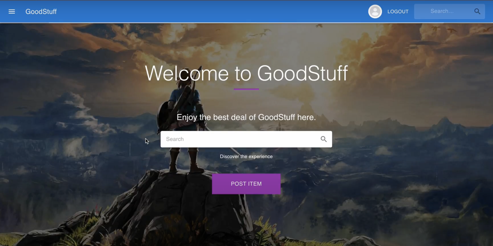
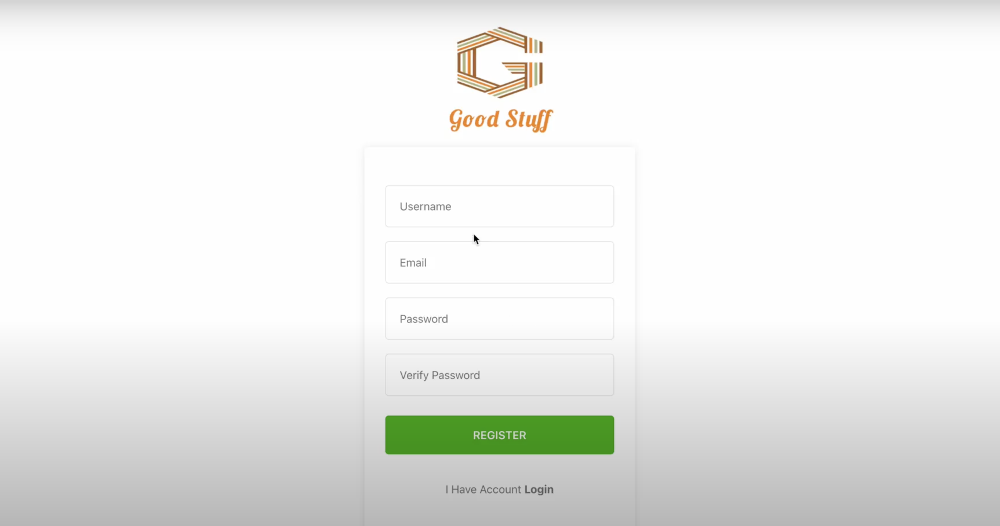
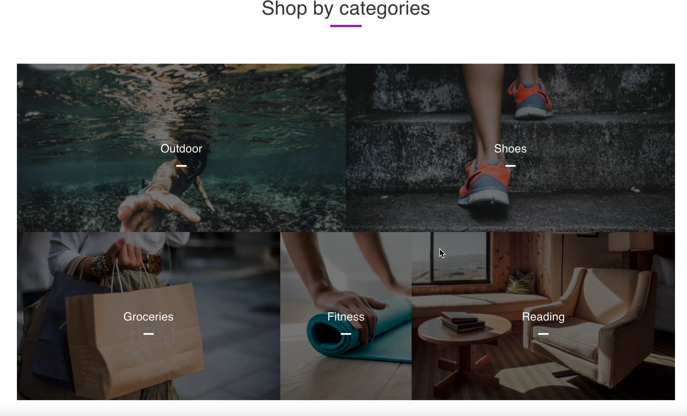
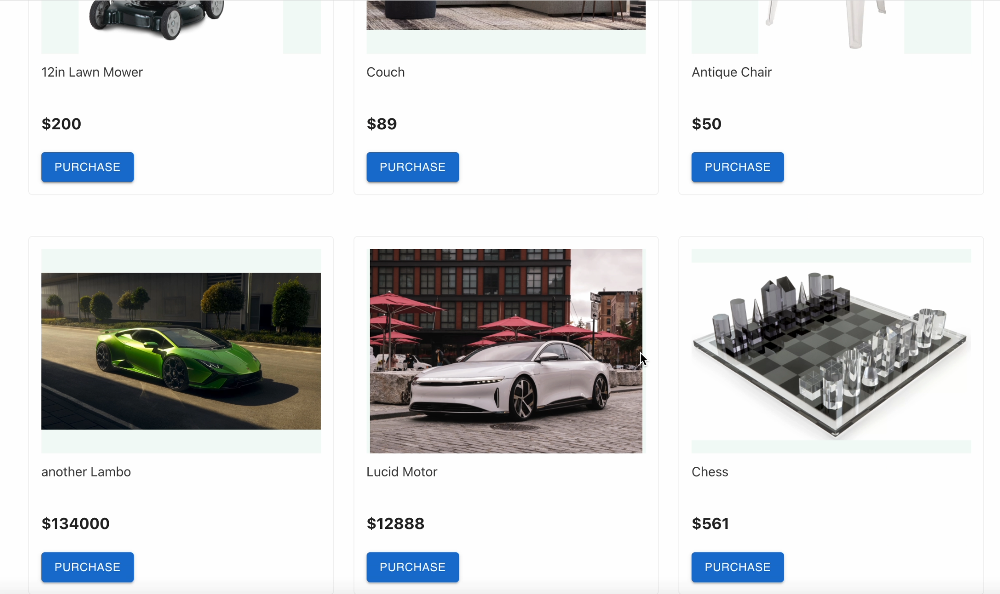
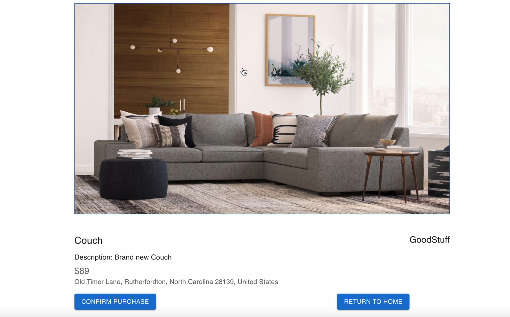

## GoodStuff

project CI: https://github.com/CSC-307-project/GoodStuff/actions

Tech Stacks used: React, Material-UI, express.js, MongoDB, Mapbox, Jest

Project Blurb: 
For consumers and providers who would like to buy or sell a given product. GoodStuff is a website application that provides channels between sellers and buyers. Unlike Craigslist, our product allows users to see their listing/selling/purchasings statistics and ability to purchase.

Our web application allows customers to create an account, post products, and buy products. The customer can then see their listings, sold listings, and view their purchases, along with all the statistics. To purchase a product, the customer can use the search feature, which filters the product by "keywords". Within the product details, the customer view all the product details, including an interactive map listing the address. However, to post a product, a customer will enter all the required fields, which feature an image uploader and an address autocomplete. This application is robust, as all errors are generally checked. For example, creating an account or posting an item, if there are any errors, the customer will see a red message.

Development Environment Set Up:
Locally: 
1. Need .env file
2. Run two terminals, one on backend folder and one on frontend
3. Ensure that 'npm install' is ran, to install dependencies
4. On frontend, run 'npm start'
5. On backend, run 'npx nodemon backend.js'

Diagrams: See wiki page on GitHub
- Class Diagram: https://app.diagrams.net/#G1ONzdCxo_0LS9jnZZODIH8YIhjYo0QgWZ
- Use Case Diagram: https://app.diagrams.net/#G13fXe-aO3icCvGC0dkMuMD7pQ33KJlVwP

Previews:

